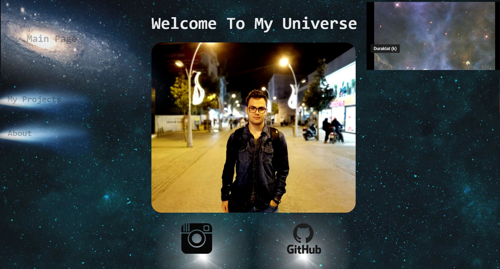
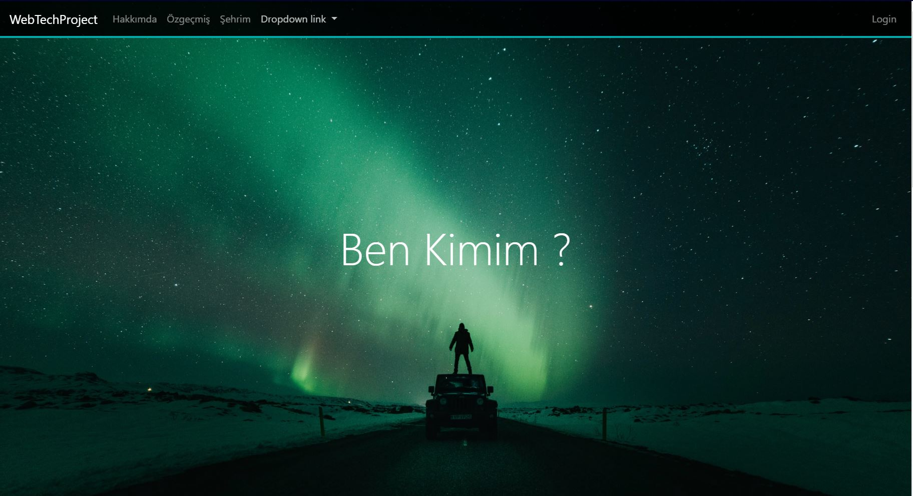

# 2019-2020 BAHAR DÖNEMİ WEB TEKNOLOJİLERİ DERSİ PROJE ÖDEVİ

## Proje Amacı
* Derste öğrenilen bilgiler (HTML, CSS, Javascript vb.) kullanılarak bir web sitesi geliştirilmesi

* Proje Detayları
	Öğrenciler bireysel olarak kendilerini ve memleketlerini tanıtan kişisel bir web sitesi uygulaması geliştireceklerdir. 

* Site tasarımı olarak Bootstrap içeren responsive (çözünürlüğe göre değişen tasarım) (hazır tema kullanılamaz)  bir yapı kullanılmalıdır. 

* Hakkında sayfası giriş sayfası niteliğinde olmalı, sayfa sahibinin kendini tanıtan bilgiler (Hobiler, Etkinlikler vb ) , sevdiği spor,etkinlik vb  ait resimler, linkler vb. içermelidir.
* Eğitim bilgilerini içeren CV niteliğinde table , div’lerin kullanıldığı özgeçmiş sayfası olmalıdır.

* Şehrim şeklinde bir sayfa olmalı, bu sayfada memletinize ya da sevdiğiniz şehre ait bilgiler yer almalıdır. (Şehrin nufusu, gezilecek yerler vb)  Sayfanın başında ya da sonunda en az 4 resimden oluşan bir slider yer almalıdır. Slider’da yer alan resimlere tıklandığında ilgili resimlere ait  içeriklere link olmalıdır.(İçerikler ayrıntılı olmadan site içersinde yer almalı)

* Mirasımız linkli bir sayfa ile, şehre ait kültürel miras niteliğindeki önemli bir eser; ya da Takımımız linkli bir sayfada şehrin takımı (Futbol,Basketbol vb branş farketmez) html elamanları kullanılarak tanıtılmalıdır.

* Sitede bir login sayfası yer almalıdır. Login sayfasında  öğrenci numaranıza ait kullanıcı adı (örneğin b1812100001@sakarya.edu.tr) ve  şifre (şifre  “123” gibi bişey olabilir)  bir php sayafasına post edilip burada kullanıcı bilgileri gönderilen sayfada tanımlanan değişkenler ile kontrol edilmelidir. Eğer kontrol işlemi başarılı ise post edilen sayfada  Hoşgeldiniz “b1812100001”  gibi bir mesajla login işleminin başarılı olduğu bildirilmeli, login işlemi başarısız ise kullanıcı login sayfasına geri yönlendirilmelidir. Aynı zamanda login sayfasında kullanıcı adı ve şifre alanının boş geçilmemesi ve kullanıcı adının mail adresi olup olmadığı kontrol edilmelidir.

* Sitede form elamanları içeren bir iletişim sayfası olmalıdır.
	İletişim sayfası tüm form elemanlarını içermeli, formun tüm elamanlarının elemanın özelliğine göre seçim yada veri girişi yapılacak şekilde gönderilmesi sağlanmalıdır.
	İletişim formundaki gerekli kontrol işlemleri (boş mu, e-mail formatında mı vb.) javascript kullanılarak denetlenmelidir. 
	Form, temizle ve gönder butonları içermelidir.
	Gönderilen form bilgileri başka bir sayfada görüntülenmelidir. 

* Projenin içindeki stiller (renk, yazı tipi, vs.) ayrı bir stil dosyasında tutulmalıdır. 

* GitHub üzerinde bir proje oluşturulup (proje herkese açık olmalı) ilk etapta proje hakkında kısa bir bilgi dökümanı GitHub’a yüklenmelidir.  Proje ilerledikçe,  gelişmeler GitHub’a yüklenmeye devam edilmelidir. (Proje teslim edilmeden GitHub’da farklı tarihlerde minimum 3 commit olmalıdır.) 

* 1.ödev bölümüne GitHub proje linki  ile beraber  kısa  bilgi dökümanı  gönderilmelidr. 

## Daha Önceki Çalışmalarım

Daha önce MaviDurak-IO'nun mentörlük projesi kapsamında amatör düzeyde kendi web sitemi oluşturmaya çalışmıştım. Görsel ağırlıklı
iletişim bilgilerim linkte bulunan tek sayfalık bir çalışma olmuştu. O günlerden bu yana birçok yeni şey öğrendim. Tabi o zaman 
responsive yapmak gibi bir derdim olmadığı için farklı çözünürlüklerde büyüsü bozuluyordu. Bu seferki çalışmam çok daha büyük ve gerçekçi
olacak.
 
 
 
 [Resimdeki projenin github linki](https://github.com/DEONSKY/mentor-project-2)
 
  
## Bu projenin tasarımı
 
* Hakkımda bölümünde kendimi kısaca tanıtıp ilgi alanlarımdan bahsedecem.

* Eğitim bilgilerini içeren özgeçmişim kısmı olacak

* Şehrim kısmında yaşadığım yeri bol görselli tanıtacam. Bu yüzden bu kısımdaki görselleri internet üzerinden çekmeyi düşünüyorum.

* Geliştirdikçe ekstra özellikler ekleyeblirim.

* Commitleri conflictler oluşması açısından her sayfa tamamlandığında pushlamayı düşünüyorum

